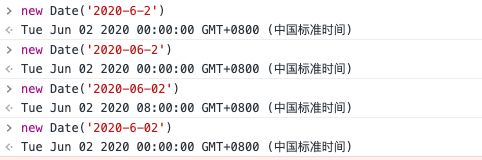

### 前言
最近在做企康相关的业务时，为了方便一直是在开发者工具或者谷歌浏览器的手机模式下开发联调的，后来在过 demo 的时候，是在真机上测试，但是发现页面流程走不下去，当时接口也没有返回报错信息，开始就想不明白问题处置来什么地方，后来找后端同学查看了日志之后，才发现问题所在。

### 结论
形如`YYYY-MM-D`、`YYYY-M-DD`、`YYYY-M-D`日期的格式，在移动端（ios）下通过`new Date('YYYY-M-D').getTime()`转化出来的是`NaN`

### 排查历程
在做订单信息时，用到了微信的日期组件,最开始是这样使用：
```jsx
<Picker
  className="form-value"
  mode="date"
  value={date}>
  {date ? (
    <Text className="field-value">{date}</Text>
  ) : (
    <Text className="field-value field-placeholder">请选择日期</Text>
  )}
</Picker>
```
看微信的官方文档，当`mode = date`其`value`属性值格式默认是`YYYY-MM-DD`，但是在经过`Taro-h5`编译之后，并不是`YYYY-MM-DD`的格式，他们也没有提供一个属性来去配置成`YYYY-MM-DD`的格式，因此，就出现了上述的问题

#### 解决方案
通过一个方法，进行转译
```js
// 在移动端 不支持 yyyy-M-d 格式的时间转化成时间戳，这里需要手动处理
export const formatDate2yyyyMMdd = (date: string, delimiter = '-'): string => {
  if (!date) return '';
  const temp: string[] = date.split(delimiter);
  // 处理月份
  temp[1] = temp[1].padStart(2, '0');
  // 处理日
  temp[2] = temp[2].padStart(2, '0');
  return temp.join(delimiter);
}
```
在使用的地方，也要做一下更改
```jsx
const handleFormChange = (e: any) => {
  this.setState({
    date: formatDate2yyyyMMdd(e.detail.value)
  });
};

<Picker
  className="form-value"
  mode="date"
  value={date}
  onChange={e => handleFormChange(e)}>
  {date ? (
    <Text className="field-value">{date}</Text>
  ) : (
    <Text className="field-value field-placeholder">请选择日期</Text>
  )}
</Picker>
```

### 后记
虽然`微信开发这工具`、`PC 端浏览器`、`安卓系统`能够对`YYYY-MM-D`、`YYYY-M-DD`、`YYYY-M-D`进行`new Date('YYYY-M-D').getTime()`转化得到时间戳，但是格式化出来的时间戳也是不一致的，如下图：

